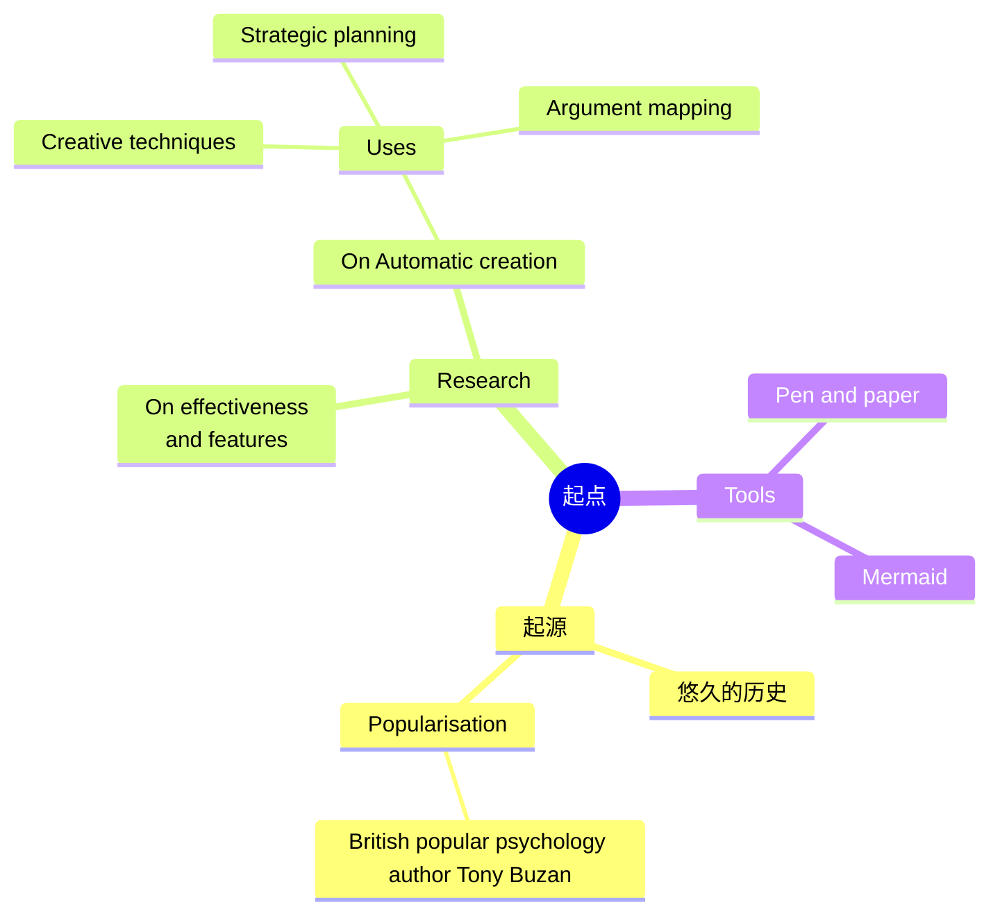

# 前言
## 为什么要写这个笔记

我以前也想过要部署这个笔记网站，但是最后还是没有部署起来。主要原因就是我在学习实在是太忙了，大二的时候为了卷保研，没有时间去搞这些东西（虽然最后我也没有成功保研）。大三的时候，考研又占据了我的大部分时间，每一天都是早上6点30分起床然后去图书馆学习到晚上闭馆，即使这么努力了，最后我还是差了一点，最后的结果就是没有考上。虽然考研失败了，但是我还是找到了一个我目前来看比较满意的工作，工作的内容不是很辛苦，若要说辛苦，可能就是要频繁的出差，但好在我目前是一个人在这个城市，并没啥挂念。大学期间，我和我高中的对象分手之后，一年之后遇到了现在的对象，她是一个很刻苦的人，做事认真，不骄不躁。我很佩服她，也很喜欢她，虽然现在她在另一个城市读研，而我在工作，但是她没有说什么。我们的感情也没有变淡。最近我们马上就二周年了，周年纪念日也刚好是她的生日，我准备了惊喜给她，希望她会喜欢。最后，我要感谢我的对象，她没有在我失败的时候离开我。在我考研失败，整天心情低落的时候，她会坚持陪着我。今天这个站点刚开始建立起来，我会好好丰富这个站点的，记录学习，也记录美好的生活。

## 笔记内容的来由

我是一个兴趣驱动的人，只要是我感兴趣的东西，我都愿意去学。实不相瞒，我本科并非是计算机专业的，我本科读的是电气工程专业，但是这不妨碍我对计算机技术的兴趣。我觉得程序员是这个世界上最厉害的人群，他们能用键盘实现很多的奇思妙想。将所学转换为实际产出，这才是我们学习的终极目标。目前，大二的时候学过一整子的前端，但是后面由于课程的压力最后又没有怎么学了，现在工作了，想学一下python，希望可以加快我的工作效率。此外我还打算学习一下Linux操作系统，因为我觉得开源是这样的世界上最伟大的发明，知识就应该是没有边界的，只有知识共享了，这样才能不断地进步。

## 致谢

- [VitePress](https://vitepress.dev/)
- [ArchLinux](https://archlinux.org/)
- [JetBrains](https://www.jetbrains.com/)
- [西南交通大学](https://www.swjtu.edu.cn/)
- [黑马程序员](https://www.itheima.com/)
- [我的小学霸月月](https://zh.wikipedia.org/wiki/%E5%A5%B3%E6%9C%8B%E5%8F%8B)

## Mermaid示例
mermaid是一个类似于markdown格式的文本语言主要用于生成各类线图，具体的使用方法可以参考[Mermaid](https://mermaid.nodejs.cn/ecosystem/tutorials.html)的中文网，我也不会，我也是在2024/10/23的21:34:23在互联网上发现的这个玩意。学就完事了。

```mmd
mindmap
  root((mindmap))
    Origins
      Long history
      ::icon(fa fa-book)
      Popularisation
        British popular psychology author Tony Buzan
    Research
      On effectiveness<br/>and features
      On Automatic creation
        Uses
            Creative techniques
            Strategic planning
            Argument mapping
    Tools
      Pen and paper
      Mermaid
```